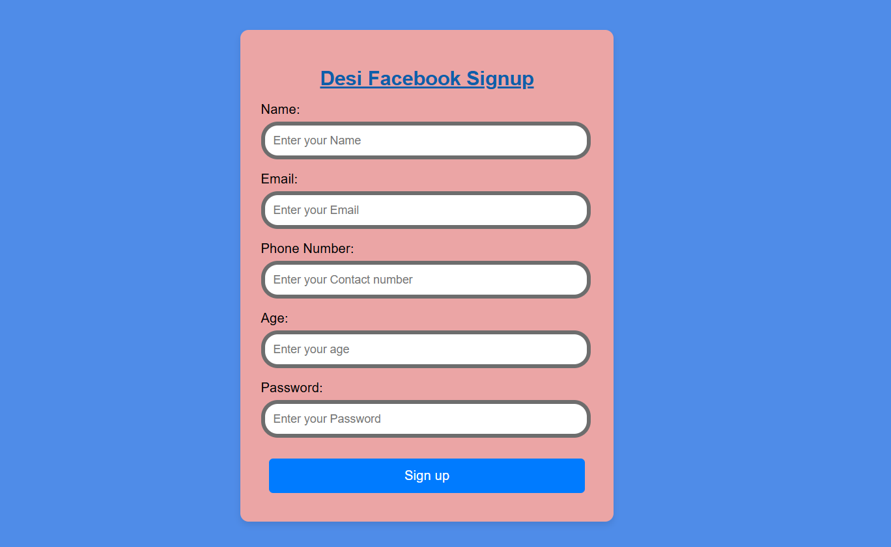

# Desi Facebook Signup Form

A simple and interactive signup form inspired by Facebook, built using **HTML**, **CSS**, and **JavaScript**. This is a beginner-level project focused on form validation, user interaction, and DOM manipulation.

---

## 📌 Project Features

- 📋 Basic user input form with fields: Name, Email, Phone Number, Age, and Password
- ✅ Real-time form validation using JavaScript
- 🧠 Input error messages for incorrect entries
- 🖱️ Interactive button text change on hover
- 💾 User data saved to browser’s local storage
- 💅 Simple responsive design using Flexbox and styled with pure CSS

---

## 📂 File Structure

```
📁 Desi-Facebook-Signup/
├── index.html        # Main HTML structure of the form
├── signup.css        # Styling for form layout and elements
├── signup.js         # Form validation and local storage logic
└── README.md         # Project documentation
```

---

## 🚀 How to Run

1. Clone the repository:

```bash
git clone https://github.com/your-username/desi-facebook-signup.git
```

2. Open the folder:

```bash
cd desi-facebook-signup
```

3. Launch the project by opening `index.html` in your browser:

```bash
start index.html    # For Windows
open index.html     # For macOS
```

---

## 📷 Preview

```markdown

```

---

## 🧑‍💻 Author

Made with ❤️ by Vinay Kumar Vishwakarma  
This is my first basic development project. More awesome stuff coming soon!


